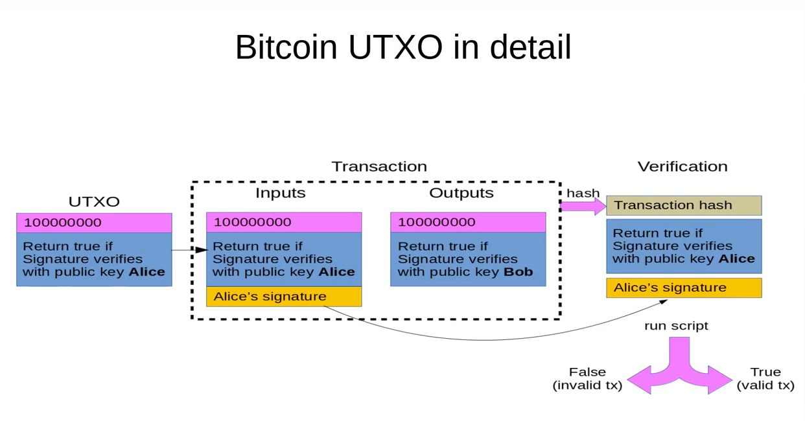

# UTXO model

UTXO là viết tắt của Unspent Transaction Output. Đây là mô hình giao dịch [[transaction-model]] được bitcoin sử dụng. Hãy chú ý đến các từ này `Unspent` và `Transaction Output`, ta sẽ hiểu chúng ngay sau đây.

Hãy tưởng tượng bạn có 3 tờ tiền giấy: 1 tờ 10$, 1 tờ 20$, 1 tờ 50$. Bây giờ bạn đi mua một món đồ có giá 15$. Tất nhiên bạn không thể xé nhỏ tờ 20$ ra, bạn phải đưa cho người bán (tạm gọi là anh X.) cả tờ 20$ và anh X. trả lại cho bạn 5$. Nếu món đồ trị giá 25$, bạn sẽ đưa cho họ 1 tờ 10$ và 1 tờ 20$, sau đó họ trả lại cho bạn 5$. Trong ví dụ này, bạn đã sử dụng 2 UTXO, 1 có mệnh giá 10$ và 1 có mệnh giá 20$, sau đó bạn nhận lại 1 UTXO mệnh giá 5$.

Như vậy ta có thể thấy rằng UTXO là một lượng tiền *không chia nhỏ được*, có thể *được tạo ra sau mỗi giao dịch*. Đó là lý do nó được gọi là `Transaction Output`. Đến đây bạn có thể hỏi vậy `Transaction Input` thì là gì? Đó cũng chính là UTXO bạn nhận được từ transaction trước. Quay lại ví dụ trên, tờ 5$ bạn nhận được từ anh X. có thể được dùng để mua một món hàng khác, khi đó nó trở thành input của 1 transaction. Chừng nào nó chưa được sử dụng làm input của 1 transaction, ta gọi là nó chưa được tiêu, vì vậy nó có tên là `Unspent`. Bất cứ khi nào bạn muốn biết mình còn bao nhiêu tiền, bạn phải cộng tổng tất cả các đồng tiền chưa tiêu của mình, hay các UTXO.

> **Transaction** bao gồm input và output, mà chúng đều là các UTXO.
> ```
> transaction = [UTXO] => [UTXO]
> ```

Ta có thể thấy UTXO rất giống các đồng tiền vật lý trong thực tế. Nhưng điều làm nó khác biệt, đó là nó chứa *điều kiện để transaction có thể được diễn ra* (tất nhiên ngoại trừ việc nó chưa được tiêu). Ví dụ một điều kiện cơ bản, đó là nó phải được chứng minh là thuộc về bạn, hay có thể được tiêu bởi bạn. Trong thế giới crypto, điều đó có nghĩa là nó được ký bởi private key của bạn. Sơ đồ dưới đây tóm tắt những thông tin trên


*source https://youtu.be/g3FlM_WOwBU*

Tóm lại UTXO bao gồm:
- 1 số lượng token không chia nhỏ được, được tạo ra sau mỗi giao dịch, và được sử dụng là đầu vào cho giao dịch tiếp theo
- điều kiện để giao dịch có thể được thực hiện

## Ưu và nhược điểm của UTXO

**Ưu điểm**

- Không cần lưu state hiện tại, mỗi giao dịch chỉ cần quan tâm đến các UTXO đầu vào mà nó được đưa cho. Nhờ thế dễ dàng xử lý giao dịch song song.
- Chống double spent, vì không thể sử dụng 1 UTXO 2 lần
- Người dùng có sự bảo mật thông tin cao hơn, như đã nói ở trên, giao dịch không cần quan tâm đến bất kỳ state nào khác ngoài bản thân các UTXO

**Nhược điểm**

- Khá khó hiểu cho người mới, hay khi phải query state, ta phải tìm hết các UTXO được sở hữu bởi 1 ai đó rồi cộng lại
- Implement smartcontract khá khó khăn, điều này sẽ được giải quyết nhờ eUTXO


[//begin]: # "Autogenerated link references for markdown compatibility"
[transaction-model]: transaction-model.md "Transaction model"
[//end]: # "Autogenerated link references"